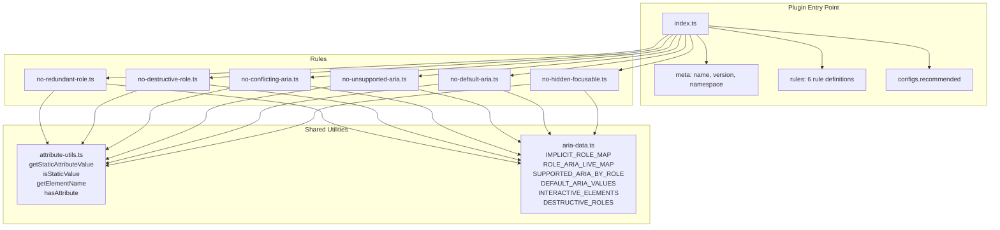

# Design Document

## Overview

This document describes the technical design for `eslint-plugin-prefer-implicit`, an ESLint plugin that enforces implicit HTML semantics over explicit ARIA attributes and roles. The plugin targets ESLint ^10.0.0 (flat config only), is written in TypeScript, and ships six rules:

1. `no-redundant-role` — flags `role` attributes that match an element's implicit role
2. `no-destructive-role` — flags `role="none"` / `role="presentation"` on interactive/structural elements
3. `no-conflicting-aria` — flags `aria-live` values that contradict a role's implied live region behavior
4. `no-unsupported-aria` — flags ARIA attributes not supported by an element's role
5. `no-default-aria` — flags ARIA attributes set to their spec-defined default or empty values
6. `no-hidden-focusable` — flags elements that are both focusable and `aria-hidden="true"`

Each rule supports conservative autofix for static attribute values only. Dynamic values (JSX expressions, Vue bindings, Angular bindings) are detected and skipped.

The plugin works with plain HTML, JSX (React), Vue templates, and Angular templates by operating on the AST nodes provided by the respective parsers — it does not parse templates itself.

### Key Design Decisions

- **Data-driven rules**: Each rule is powered by declarative lookup tables (implicit role maps, supported ARIA maps, default value maps) rather than hard-coded conditionals. This makes the rules easy to extend and audit.
- **Parser-agnostic attribute reading**: A shared utility layer normalizes attribute access across different AST shapes (ESTree/JSX, vue-eslint-parser VElement, angular-eslint TmplAst). Rules call a single `getStaticAttributeValue(node, attrName)` function.
- **Static-only autofix**: The `Autofix_Engine` only generates `fixer.remove()` operations for attributes whose values are string literals. This avoids breaking dynamic behavior.
- **Flat config only**: The plugin exports a default object with `meta`, `rules`, and `configs` properties per the ESLint ^10 plugin contract. No legacy `.eslintrc` support.

---

## Architecture



### Project Structure

```
eslint-plugin-prefer-implicit/
├── src/
│   ├── index.ts                  # Plugin entry point (default export)
│   ├── rules/
│   │   ├── no-redundant-role.ts
│   │   ├── no-destructive-role.ts
│   │   ├── no-conflicting-aria.ts
│   │   ├── no-unsupported-aria.ts
│   │   ├── no-default-aria.ts
│   │   └── no-hidden-focusable.ts
│   └── utils/
│       ├── attribute-utils.ts    # AST attribute helpers
│       └── aria-data.ts          # ARIA/HTML lookup tables
├── tests/
│   ├── rules/
│   │   ├── no-redundant-role.test.ts
│   │   ├── no-destructive-role.test.ts
│   │   ├── no-conflicting-aria.test.ts
│   │   ├── no-unsupported-aria.test.ts
│   │   ├── no-default-aria.test.ts
│   │   └── no-hidden-focusable.test.ts
│   └── utils/
│       ├── attribute-utils.test.ts
│       └── aria-data.test.ts
├── tsconfig.json
├── vitest.config.ts
├── package.json
├── .changeset/
│   └── config.json
├── .gitignore
└── README.md
```

### Build and Publish Pipeline

- **TypeScript** compiles `src/` to `dist/` (ESM output, declaration files).
- **Vitest** runs all tests from `tests/`.
- **Changesets** manages versioning: `changeset version` bumps version + updates CHANGELOG, `changeset publish` publishes to NPM.
- `package.json` `files` field includes only `dist/` and `README.md`.

---

## Components and Interfaces

### 1. Plugin Entry Point (`src/index.ts`)

The default export conforms to the ESLint flat config plugin interface:

```typescript
import type { ESLint } from "eslint";

import noRedundantRole from "./rules/no-redundant-role.js";
import noDestructiveRole from "./rules/no-destructive-role.js";
import noConflictingAria from "./rules/no-conflicting-aria.js";
import noUnsupportedAria from "./rules/no-unsupported-aria.js";
import noDefaultAria from "./rules/no-default-aria.js";
import noHiddenFocusable from "./rules/no-hidden-focusable.js";

const plugin: ESLint.Plugin = {
  meta: {
    name: "eslint-plugin-prefer-implicit",
    version: "0.1.0",       // read from package.json at build time
    namespace: "prefer-implicit",
  },
  rules: {
    "no-redundant-role": noRedundantRole,
    "no-destructive-role": noDestructiveRole,
    "no-conflicting-aria": noConflictingAria,
    "no-unsupported-aria": noUnsupportedAria,
    "no-default-aria": noDefaultAria,
    "no-hidden-focusable": noHiddenFocusable,
  },
  configs: {},
};

// Attach recommended config after plugin is defined (self-reference)
plugin.configs!.recommended = {
  plugins: {
    "prefer-implicit": plugin,
  },
  rules: {
    "prefer-implicit/no-redundant-role": "warn",
    "prefer-implicit/no-destructive-role": "warn",
    "prefer-implicit/no-conflicting-aria": "warn",
    "prefer-implicit/no-unsupported-aria": "warn",
    "prefer-implicit/no-default-aria": "warn",
    "prefer-implicit/no-hidden-focusable": "warn",
  },
};

export default plugin;
```

### 2. Rule Interface

Each rule follows the standard ESLint rule module shape:

```typescript
import type { Rule } from "eslint";

const rule: Rule.RuleModule = {
  meta: {
    type: "suggestion",
    docs: {
      description: "...",
      url: "...",
    },
    fixable: "code",
    schema: [],
    messages: {
      messageId: "Message template with {{placeholder}}",
    },
  },
  create(context: Rule.RuleContext): Rule.RuleListener {
    return {
      // AST visitor callbacks
    };
  },
};

export default rule;
```

All six rules use `type: "suggestion"` and `fixable: "code"`. Each rule defines `messages` with `messageId`-based reporting.

### 3. Attribute Utilities (`src/utils/attribute-utils.ts`)

This module provides parser-agnostic helpers for reading element names and attribute values from AST nodes.

```typescript
/**
 * Returns the lowercase tag name of an element node, or null if it cannot
 * be determined (e.g., a component reference like <MyButton>).
 */
export function getElementName(node: any): string | null;

/**
 * Returns the static string value of an attribute, or null if the attribute
 * is missing or its value is dynamic (binding, expression, etc.).
 * Handles:
 *   - ESTree/JSX: JSXAttribute with Literal value
 *   - Vue: VAttribute with VLiteral value (not VExpressionContainer)
 *   - Angular: TmplAstTextAttribute (not TmplAstBoundAttribute)
 *   - HTML: standard attribute nodes with string values
 */
export function getStaticAttributeValue(
  node: any,
  attributeName: string
): string | null;

/**
 * Returns true if the attribute exists on the node, regardless of whether
 * its value is static or dynamic.
 */
export function hasAttribute(node: any, attributeName: string): boolean;

/**
 * Returns true if the attribute value is dynamic (bound via framework syntax).
 */
export function isDynamicValue(node: any, attributeName: string): boolean;

/**
 * Returns the AST node for a specific attribute, or null if not found.
 * Used by the autofix engine to get the range for removal.
 */
export function getAttributeNode(node: any, attributeName: string): any | null;
```

**Framework detection strategy**: The utility inspects the AST node's `type` property to determine which parser produced it:

| Parser | Element node type | Attribute node type | Static value check |
|--------|------------------|--------------------|--------------------|
| Default (ESTree) | `JSXOpeningElement` | `JSXAttribute` with `value.type === "Literal"` | `value.type === "Literal"` |
| vue-eslint-parser | `VElement` | `VAttribute` without directive flag | `value.type === "VLiteral"` |
| angular-eslint | `Element$1` | `TextAttribute` (not `BoundAttribute`) | Always static for `TextAttribute` |
| HTML parser | `Tag` / `Element` | Attribute with string value | Always static |

### 4. ARIA Data Module (`src/utils/aria-data.ts`)

Declarative lookup tables derived from the [ARIA in HTML](https://www.w3.org/TR/html-aria/) and [WAI-ARIA 1.2](https://w3c.github.io/aria/) specifications.

```typescript
/**
 * Maps HTML element names to their implicit ARIA role.
 * Only includes elements relevant to the plugin's rules.
 * Some elements have conditional implicit roles (e.g., <a> only has
 * role="link" when it has an href attribute), handled via a condition function.
 */
export const IMPLICIT_ROLE_MAP: Record<
  string,
  { role: string; condition?: (node: any) => boolean }
>;

/**
 * Maps ARIA roles to their implied aria-live value.
 * Used by no-conflicting-aria.
 */
export const ROLE_ARIA_LIVE_MAP: Record<string, string>;

/**
 * Maps ARIA roles to the set of aria-* attributes they support.
 * Used by no-unsupported-aria.
 */
export const SUPPORTED_ARIA_BY_ROLE: Record<string, Set<string>>;

/**
 * Maps aria-* attributes to their specification-defined default values.
 * Used by no-default-aria.
 */
export const DEFAULT_ARIA_VALUES: Record<string, string>;

/**
 * Set of HTML elements that are natively interactive (focusable without tabindex).
 * Used by no-destructive-role and no-hidden-focusable.
 */
export const INTERACTIVE_ELEMENTS: Set<string>;

/**
 * Set of role values considered destructive when applied to interactive
 * or structural elements.
 */
export const DESTRUCTIVE_ROLES: Set<string>;

/**
 * Set of HTML elements that are structural (lists, tables) and should
 * not have their semantics removed.
 */
export const STRUCTURAL_ELEMENTS: Set<string>;
```

### 5. Rule Implementations

#### 5.1 `no-redundant-role`

```
Visitor: JSXOpeningElement | VElement | Element
1. Get element name via getElementName(node)
2. Look up IMPLICIT_ROLE_MAP[elementName]
3. If entry exists and condition (if any) passes:
   a. Get role = getStaticAttributeValue(node, "role")
   b. If role === null → skip (dynamic or missing)
   c. If role === implicitRole → report violation, offer fix to remove role attribute
   d. Else → no violation
```

#### 5.2 `no-destructive-role`

```
Visitor: JSXOpeningElement | VElement | Element
1. Get element name via getElementName(node)
2. Check if element is in INTERACTIVE_ELEMENTS or STRUCTURAL_ELEMENTS
   (for <a>, also check hasAttribute(node, "href"))
3. Get role = getStaticAttributeValue(node, "role")
4. If role === null → skip
5. If DESTRUCTIVE_ROLES.has(role) → report violation, offer fix to remove role attribute
```

#### 5.3 `no-conflicting-aria`

```
Visitor: JSXOpeningElement | VElement | Element
1. Get role = getStaticAttributeValue(node, "role")
2. If role === null or role not in ROLE_ARIA_LIVE_MAP → skip
3. Get ariaLive = getStaticAttributeValue(node, "aria-live")
4. If ariaLive === null → skip
5. impliedLive = ROLE_ARIA_LIVE_MAP[role]
6. If ariaLive !== impliedLive → report violation, offer fix to remove aria-live
7. If ariaLive === impliedLive → no violation (redundant but not conflicting)
```

#### 5.4 `no-unsupported-aria`

```
Visitor: JSXOpeningElement | VElement | Element
1. Determine effective role:
   a. role = getStaticAttributeValue(node, "role")
   b. If role === null → look up IMPLICIT_ROLE_MAP[elementName]
   c. If no role found → skip
2. Get supportedAttrs = SUPPORTED_ARIA_BY_ROLE[effectiveRole]
3. For each aria-* attribute on the node:
   a. If getStaticAttributeValue returns null → skip (dynamic)
   b. If attribute not in supportedAttrs → report violation, offer fix to remove
```

#### 5.5 `no-default-aria`

```
Visitor: JSXOpeningElement | VElement | Element
1. For each aria-* attribute on the node:
   a. value = getStaticAttributeValue(node, attrName)
   b. If value === null → skip (dynamic)
   c. If value === "" → report "empty aria attribute" violation, offer fix
   d. If DEFAULT_ARIA_VALUES[attrName] === value → report "default value" violation, offer fix
```

#### 5.6 `no-hidden-focusable`

```
Visitor: JSXOpeningElement | VElement | Element
1. ariaHidden = getStaticAttributeValue(node, "aria-hidden")
2. If ariaHidden !== "true" → skip
3. Determine if element is focusable:
   a. Element is in INTERACTIVE_ELEMENTS (and for <a>, has href)
   b. OR element has tabindex attribute with value >= 0
4. If focusable → report violation, offer fix to remove aria-hidden
5. If tabindex is present but value is "-1" → no violation
```

### 6. Autofix Engine

The autofix logic is embedded in each rule's `report()` call. It uses ESLint's `fixer` API:

```typescript
context.report({
  node: attributeNode,
  messageId: "redundantRole",
  data: { element: elementName, role: roleValue },
  fix(fixer) {
    const attrNode = getAttributeNode(node, "role");
    if (attrNode) {
      return fixer.remove(attrNode);
    }
    return null;
  },
});
```

Autofix is only offered when:
1. The attribute value is a `Static_Value` (verified by `getStaticAttributeValue` returning non-null)
2. The fix is a simple removal (no attribute value rewriting)

---

## Data Models

### Implicit Role Map

Derived from the [ARIA in HTML W3C Recommendation](https://www.w3.org/TR/html-aria/) implicit ARIA semantics table.

```typescript
export const IMPLICIT_ROLE_MAP: Record<
  string,
  { role: string; condition?: (node: any) => boolean }
> = {
  a:        { role: "link",       condition: (n) => hasAttribute(n, "href") },
  article:  { role: "article" },
  aside:    { role: "complementary" },
  button:   { role: "button" },
  datalist: { role: "listbox" },
  details:  { role: "group" },
  dialog:   { role: "dialog" },
  fieldset: { role: "group" },
  figure:   { role: "figure" },
  footer:   { role: "contentinfo" },  // when not nested in article/section
  form:     { role: "form" },
  h1:       { role: "heading" },
  h2:       { role: "heading" },
  h3:       { role: "heading" },
  h4:       { role: "heading" },
  h5:       { role: "heading" },
  h6:       { role: "heading" },
  header:   { role: "banner" },       // when not nested in article/section
  hr:       { role: "separator" },
  img:      { role: "img" },
  input:    { role: "textbox" },      // simplified; actual role depends on type
  li:       { role: "listitem" },
  main:     { role: "main" },
  menu:     { role: "list" },
  nav:      { role: "navigation" },
  ol:       { role: "list" },
  optgroup: { role: "group" },
  option:   { role: "option" },
  output:   { role: "status" },
  progress: { role: "progressbar" },
  select:   { role: "combobox" },     // simplified
  summary:  { role: "button" },
  table:    { role: "table" },
  tbody:    { role: "rowgroup" },
  td:       { role: "cell" },
  textarea: { role: "textbox" },
  tfoot:    { role: "rowgroup" },
  th:       { role: "columnheader" }, // simplified
  thead:    { role: "rowgroup" },
  tr:       { role: "row" },
  ul:       { role: "list" },
};
```

### Role → Implied `aria-live` Map

```typescript
export const ROLE_ARIA_LIVE_MAP: Record<string, string> = {
  alert:     "assertive",
  log:       "polite",
  marquee:   "off",
  status:    "polite",
  timer:     "off",
};
```

### Supported ARIA Attributes by Role (subset)

```typescript
// Global ARIA attributes supported by all roles
const GLOBAL_ARIA = new Set([
  "aria-atomic", "aria-busy", "aria-controls", "aria-current",
  "aria-describedby", "aria-details", "aria-disabled",
  "aria-dropeffect", "aria-errormessage", "aria-flowto",
  "aria-grabbed", "aria-haspopup", "aria-hidden", "aria-invalid",
  "aria-keyshortcuts", "aria-label", "aria-labelledby", "aria-live",
  "aria-owns", "aria-relevant", "aria-roledescription",
]);

export const SUPPORTED_ARIA_BY_ROLE: Record<string, Set<string>> = {
  button: new Set([...GLOBAL_ARIA, "aria-expanded", "aria-pressed"]),
  link:   new Set([...GLOBAL_ARIA, "aria-expanded"]),
  img:    new Set([...GLOBAL_ARIA]),  // no widget attributes
  generic: new Set([...GLOBAL_ARIA]),
  // ... additional roles as needed
};
```

### Default ARIA Values

```typescript
export const DEFAULT_ARIA_VALUES: Record<string, string> = {
  "aria-hidden":   "false",
  "aria-required": "false",
  "aria-expanded": "false",
  "aria-pressed":  "false",
  "aria-disabled": "false",
  "aria-checked":  "false",
  "aria-selected": "false",
  "aria-grabbed":  "false",
  "aria-atomic":   "false",
  "aria-busy":     "false",
  "aria-modal":    "false",
  "aria-multiline":     "false",
  "aria-multiselectable": "false",
  "aria-readonly": "false",
};
```

### Interactive and Structural Element Sets

```typescript
export const INTERACTIVE_ELEMENTS = new Set([
  "a",       // only when href is present (checked at call site)
  "button",
  "details",
  "embed",
  "iframe",
  "input",
  "select",
  "summary",
  "textarea",
]);

export const STRUCTURAL_ELEMENTS = new Set([
  "ul", "ol", "li", "table", "thead", "tbody", "tfoot", "tr", "td", "th",
  "dl", "dt", "dd", "menu",
]);

export const DESTRUCTIVE_ROLES = new Set(["none", "presentation"]);
```


---

## Correctness Properties

*A property is a characteristic or behavior that should hold true across all valid executions of a system — essentially, a formal statement about what the system should do. Properties serve as the bridge between human-readable specifications and machine-verifiable correctness guarantees.*

### Property 1: Redundant role detection is consistent with the implicit role map

*For any* HTML element name that exists in `IMPLICIT_ROLE_MAP` and *for any* role string, the `no-redundant-role` rule SHALL report a violation if and only if the role string equals the element's implicit role (and any condition on the map entry is satisfied). Setting the role to any other value SHALL produce no violation.

**Validates: Requirements 3.6, 3.8**

### Property 2: Destructive role detection covers all interactive and structural elements

*For any* element in `INTERACTIVE_ELEMENTS` or `STRUCTURAL_ELEMENTS`, and *for any* role in `DESTRUCTIVE_ROLES` (`"none"`, `"presentation"`), the `no-destructive-role` rule SHALL report a violation when the element has that role as a static value.

**Validates: Requirements 4.4**

### Property 3: Conflicting aria-live detection is consistent with the role-to-live map

*For any* role in `ROLE_ARIA_LIVE_MAP` and *for any* `aria-live` value that differs from the role's implied live value, the `no-conflicting-aria` rule SHALL report a violation. When the `aria-live` value matches the implied value, no violation SHALL be reported.

**Validates: Requirements 5.4, 5.6**

### Property 4: Unsupported ARIA attributes are detected based on the role's supported set

*For any* element with a known role (explicit or implicit) and *for any* `aria-*` attribute that is NOT in `SUPPORTED_ARIA_BY_ROLE[role]`, the `no-unsupported-aria` rule SHALL report a violation when the attribute has a static value.

**Validates: Requirements 6.4**

### Property 5: Default and empty ARIA values are detected

*For any* `aria-*` attribute name in `DEFAULT_ARIA_VALUES` and its corresponding default value, the `no-default-aria` rule SHALL report a violation when the attribute is set to that default value. Additionally, *for any* `aria-*` attribute set to an empty string `""`, the rule SHALL report a violation.

**Validates: Requirements 7.6, 7.7**

### Property 6: Hidden-focusable conflict detection

*For any* natively focusable element (from `INTERACTIVE_ELEMENTS`, with `<a>` requiring `href`) or *for any* element with `tabindex` >= 0, when `aria-hidden="true"` is set as a static value, the `no-hidden-focusable` rule SHALL report a violation. For elements with `tabindex="-1"`, no violation SHALL be reported.

**Validates: Requirements 8.3, 8.4, 8.6**

### Property 7: Dynamic values are never flagged

*For any* of the six rules and *for any* element where the relevant attribute value is dynamic (JSX expression, Vue binding, Angular binding), the rule SHALL report no violation and the autofix engine SHALL not generate a fix.

**Validates: Requirements 3.7, 4.5, 5.5, 6.5, 7.8, 8.5, 9.5, 10.5**

### Property 8: Autofix round-trip produces valid code

*For any* rule violation detected on a static attribute value, the autofix SHALL remove the offending attribute such that re-parsing the fixed output produces an AST where the removed attribute is absent and all other attributes and element structure remain unchanged.

**Validates: Requirements 3.6, 4.4, 5.4, 6.4, 7.7, 8.4**

---

## Error Handling

### Invalid or Unknown Elements

When `getElementName()` cannot determine the tag name (e.g., a JSX component like `<MyButton>`), all rules skip the node silently. No error is thrown and no violation is reported. Custom components are not analyzed because their implicit semantics are unknown.

### Missing ARIA Data

If a role is not found in `SUPPORTED_ARIA_BY_ROLE`, the `no-unsupported-aria` rule skips the element. The data maps are intentionally conservative — only roles with well-defined supported attribute sets are included. Unknown roles are not flagged.

### Malformed Attribute Values

If an attribute value cannot be parsed (e.g., `tabindex="abc"` for `no-hidden-focusable`), the rule treats the value as non-numeric and skips the focusability check for that attribute. No error is thrown.

### Parser Compatibility

If the AST node shape does not match any known parser format (ESTree/JSX, Vue, Angular, HTML), the attribute utility functions return `null` for attribute values and `false` for `hasAttribute`. This causes rules to skip the node gracefully rather than crash.

### Autofix Safety

- Autofix is never applied to dynamic values (enforced by the `getStaticAttributeValue` gate).
- Autofix only performs attribute removal — never attribute value modification or element restructuring.
- If `getAttributeNode()` returns `null` (attribute node not found in AST), the fixer returns `null` and no fix is applied.

---

## Testing Strategy

### Test Framework

- **Vitest** as the test runner (configured in `vitest.config.ts`)
- **ESLint RuleTester** for rule-level testing (ESLint's built-in test harness)
- **fast-check** for property-based testing

### Unit Tests (Example-Based)

Each rule has a dedicated test file using ESLint's `RuleTester`. Tests are organized into `valid` and `invalid` arrays:

**For each rule:**
- **Valid cases**: Code that should NOT trigger the rule (e.g., `<button role="link">` for `no-redundant-role`)
- **Invalid cases**: Code that SHOULD trigger the rule, with expected error messages and autofix output
- **Dynamic value cases**: Code with framework bindings that should be skipped
- **Edge cases**: Boundary conditions specific to each rule

Example test structure:
```typescript
import { RuleTester } from "eslint";
import rule from "../../src/rules/no-redundant-role.js";

const tester = new RuleTester({ languageOptions: { ecmaVersion: 2022, parserOptions: { ecmaFeatures: { jsx: true } } } });

tester.run("no-redundant-role", rule, {
  valid: [
    { code: '<button role="link" />' },           // different role
    { code: '<button role={dynamicRole} />' },     // dynamic value
    { code: '<div role="button" />' },             // div has no implicit role of button
  ],
  invalid: [
    {
      code: '<button role="button" />',
      output: '<button />',
      errors: [{ messageId: "redundantRole" }],
    },
  ],
});
```

### Property-Based Tests

Property-based tests use **fast-check** to verify universal properties across generated inputs. Each property test maps to a Correctness Property from this design document.

**Configuration:**
- Minimum 100 iterations per property test (`numRuns: 100`)
- Each test is tagged with a comment referencing the design property

**Property test approach:**
- Generate random (element, role) pairs from the data maps
- Construct minimal code strings programmatically
- Run the rule using ESLint's `Linter` API (not `RuleTester`, for programmatic access to results)
- Assert the property holds for all generated inputs

Example:
```typescript
import fc from "fast-check";
import { Linter } from "eslint";
import plugin from "../../src/index.js";

// Feature: eslint-plugin-prefer-implicit, Property 1: Redundant role detection
test("Property 1: redundant role iff role matches implicit role", () => {
  const linter = new Linter();
  const entries = Object.entries(IMPLICIT_ROLE_MAP);

  fc.assert(
    fc.property(
      fc.constantFrom(...entries),
      fc.oneof(fc.constant("matching"), fc.constant("different")),
      ([element, { role: implicitRole }], mode) => {
        const roleValue = mode === "matching" ? implicitRole : "application";
        const code = `<${element} role="${roleValue}" />`;
        const messages = linter.verify(code, { /* config with plugin */ });
        if (mode === "matching") {
          return messages.length > 0; // should report
        } else {
          return messages.length === 0; // should not report
        }
      }
    ),
    { numRuns: 100 }
  );
});
```

### Test Coverage Matrix

| Rule | Example Tests | Property Tests | Edge Cases |
|------|:---:|:---:|:---:|
| no-redundant-role | R1–R5 patterns, valid cases | Property 1 (map consistency) | Components, missing role |
| no-destructive-role | R6–R8 patterns, valid cases | Property 2 (interactive/structural coverage) | `<a>` without href |
| no-conflicting-aria | A1–A3 patterns, valid non-conflict | Property 3 (live map consistency) | Missing role, missing aria-live |
| no-unsupported-aria | A4–A6 patterns, valid cases | Property 4 (supported set) | No role, unknown role |
| no-default-aria | D1–D6 patterns, valid non-default | Property 5 (default/empty detection) | Non-default values |
| no-hidden-focusable | I1–I3 patterns, tabindex=-1 | Property 6 (focusable detection) | tabindex edge values |
| All rules (cross-cutting) | — | Property 7 (dynamic skip), Property 8 (autofix round-trip) | Mixed static/dynamic |
| attribute-utils | — | Property 7 (static/dynamic classification) | Unknown node types |

### Integration Tests

- Verify the plugin loads correctly in an ESLint flat config
- Verify the `configs.recommended` preset enables all rules
- Verify framework-specific parsing (JSX, Vue, Angular) with representative code samples
